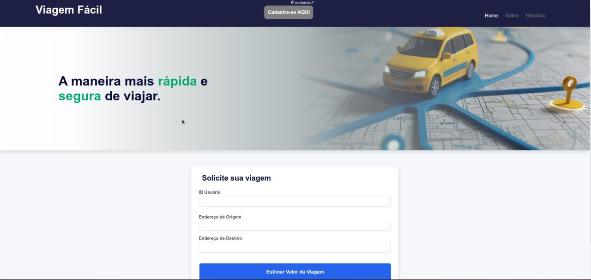

# Viagem Fácil 

Este projeto é uma aplicação fullstack desenvolvida para estimativa de viagens, cálculo de rotas e exibição de mapa estático. Ele utiliza a integração com APIs do Google Maps para fornecer uma experiência rica em funcionalidades.


-----

## Visão Geral

A aplicação permite aos usuários inserir origens e destinos, calcular rotas, exibir motoristas disponíveis, e renderizar mapas das rotas calculadas diretamente no navegador. O projeto está configurado para ser executado em um ambiente padronizado, simplificando o processo de deploy.

## Arquitetura e Tecnologias

Backend
- Node.js e TypeScript como base do servidor.
- Express.js para criação de endpoints RESTful.
- MySQL2 para manipulação e integração com o banco de dados MySQL.
- Integração com as APIs do Google:
  - Routes API (para cálculo de rotas).
  - Static Maps API (para renderização de imagens estáticas de mapas).
- Axios para comunicação com serviços externos.
  
Frontend
- React.js com TypeScript para interfaces dinâmicas.
- Context API para compartilhamento de estado global.
- Vite para uma experiência de desenvolvimento mais rápida e leve.

## Funcionalidades Principais

### Backend
Cadastro de Motoristas:
- Endpoint para criar motoristas com validações no servidor.
- Suporte a listagem de motoristas cadastrados.

Estimativa de Viagem:
- Cálculo de distância e tempo entre dois pontos utilizando a API do Google Routes.
- Geração de mapas estáticos com rotas detalhadas via Google Static Maps.

Histórico de Viagens:
- Rastreio e armazenamento de viagens realizadas.
- Suporte a filtragem por motorista e usuário.

### Frontend
Formulário de Viagem:
- Inputs validados para entrada de origem, destino.
- Renderização de resultados em tempo real.

Sugestão de Motoristas:
- Apresentação dinâmica de motoristas disponíveis para a rota.

Mapas de Rotas:
- Integração com a API Static Maps para exibir visualizações da rota calculada.

Histórico:
- Interface para visualização de viagens passadas com filtros.


## Configuração do Ambiente

1. Crie um arquivo .env na raiz do projeto com o seguinte conteúdo:

  ```bash
  GOOGLE_API_KEY=<sua_chave_da_API>
  ```

2. Com Docker Compose execute o seguinte comando na raiz do projeto:

```bash
docker-compose up --build
```

3. O frontend estará configurado para responder na porta 80.

## Melhorias Futuras
- Implementar o frontend para cadastro de motoristas.
- Utilizar sugestões da API Places nos inputs.
- Salvar sugestões em cache utilizando Redis.